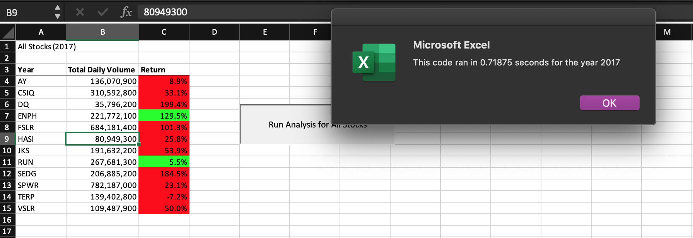
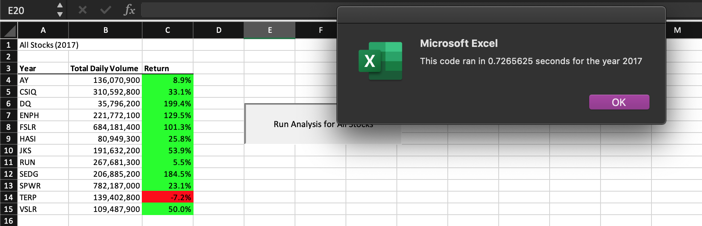
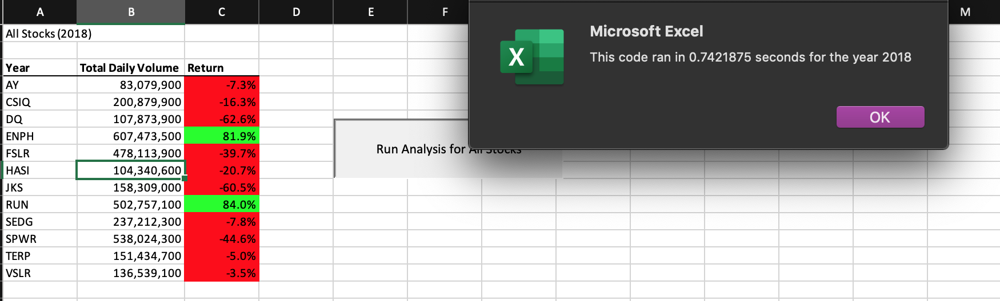
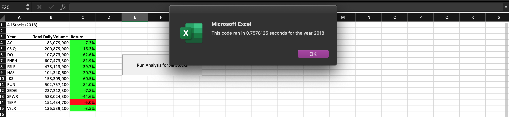

# stock-analysis

## Overview
The purpose of this analysis is to look at green energy stocks in order to help the client make the most well-informed investment. This is done by reviewing stock market data from 2017 and 2018. The original code was also refactored in order to make the the script simpler and clearer. 

## Results
After running the analysis of the stocks, it is shown that performance was better in 2017 than it was in 2018. In 2018, the only companies with positive return were the companies represented by the tickers ENPH and RUN. This starkly contrasts the results for 2017, where all companies exept for TERP yieleded positive returns. 

The original script for both the 2017 and 2018 analyses ran faster than their refactored counterparts:

## Summary

Refactoring a code is advantageous as it cleans up the code, making it easier to read and understand, as well as allows someone to identify and fix any bugs. It allows individuals to restructure the code without altering the way it behaves. However, refactoring can be time consuming, especially when working with lengthy code. It can also introduce bugs in the case that an error is accidentally written into it. 
